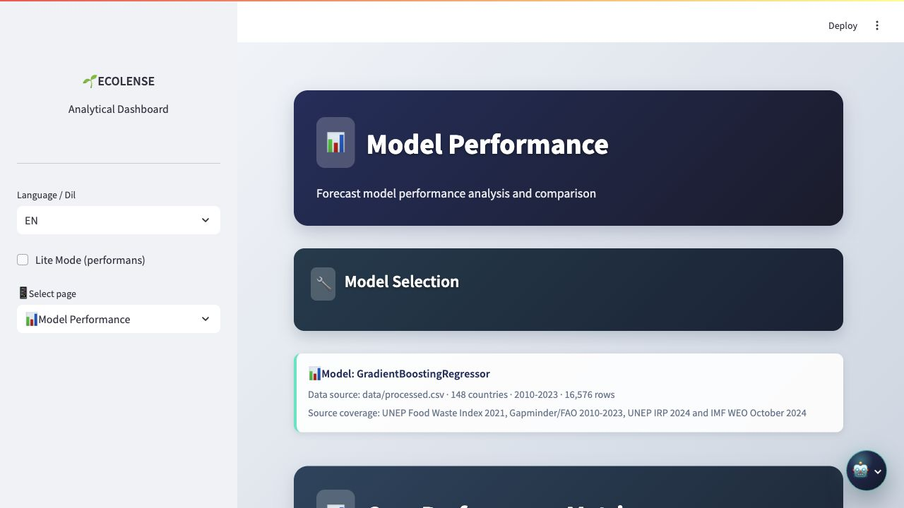

<div align="center">

# Ecolense Intelligence

### Global Food Waste Analytics and Sustainability Decision Support Platform

[](https://www.python.org/)
[](https://streamlit.io/)
[](https://scikit-learn.org/)
[](https://ecolense-intelligence.streamlit.app/)

[Live Dashboard](https://ecolense-intelligence.streamlit.app/) · [Technical Report](ecolense_intelligence_report_2026_en.md) · [Türkçe README](README.md)

</div>

---

## Overview

Ecolense Intelligence is a data-driven decision support platform for global food waste analysis. It combines food waste, economic loss, carbon footprint, and sustainability scoring at country-year-category granularity.

| Metric | Value |
|---|---:|
| Countries | 148 |
| Historical period | 2010-2023 |
| Forecast horizon | 2024-2030 |
| Observations | 16,576 |
| Average test R² | 0.9534 |
| 2023 average sustainability score | 82.7/100 |
| 2030 average sustainability projection | 82.5/100 |
| Dashboard modules | 22 |

---

## Dashboard Preview




---

## Analytical Visuals

The forecast visual does not compress unrelated scales onto one axis. Waste, economic loss, carbon, and score are shown as separate panels.


---

## Sustainability Score

The sustainability score is a 0-100 composite indicator that reads country-level food waste per capita, economic loss per capita, and carbon pressure per capita together. A higher score means these three pressures are more controlled at the same time.

In 2023, the average score is 82.7/100 and the country median is 82.9/100. The strongest scores are concentrated in India, Russia, Romania, South Africa, and Lithuania. The 2024-2030 projection keeps the score connected to the 2023 country scale and updates it according to projected changes in per-capita waste, economic loss, and carbon pressure.

---

## Dataset And Methodology

The dataset is prepared at country-year-food category level. It uses food waste, economic loss, carbon footprint, population, GDP per capita, material footprint, food price index, income group, and regional metadata.

| Publication / data version | Source | Usage | Project scope |
|---|---|---|---|
| 2010-2023 series | Gapminder GDP per capita | Country income series | GDP per capita variables |
| 2010-2023 series | FAO Food Price Index | Food price index and time effects | Year effect and food price variables |
| 2018 | Poore & Nemecek, *Science* | Category-level carbon impact | Food-category CO2e factors |
| 2021 | UNEP Food Waste Index Report | Country-level food waste indicators | Table A4.1 and country indicators |
| 2024 database update | UNEP IRP Global Material Flows Database | Material footprint indicators | Material footprint per capita |
| October 2024 | IMF World Economic Outlook Database | 2024-2030 macro projection inputs | Growth assumptions |
| Accessed June 2, 2026 | Country metadata | Region, income group, ISO code, and population | Dashboard labels and country slices |

The pipeline has three main steps:

1. Prepare source data at a shared country-year-category level
2. Build ratios, intensity metrics, interaction variables, and time features
3. Export forecast, explainability, dashboard, and report artifacts

---

## Modeling

Separate models are trained for three targets:

| Target | Description | Test R² | CV R² |
|---|---|---:|---:|
| `Total Waste (Tons)` | Total food waste | 0.9674 | 0.9684 |
| `Economic Loss (Million $)` | Economic loss | 0.9464 | 0.9458 |
| `Carbon_Footprint_kgCO2e` | Carbon footprint | 0.9464 | 0.9609 |

Gradient Boosting Regressor is used as the production model. Explainability outputs are stored as CSV files under `outputs/explainability/`, and report-ready PNG visuals are stored under `docs/assets/`.


---

## Dashboard Modules

| Module | Purpose |
|---|---|
| Home | Shows core KPI cards, quick navigation, and story entry points. |
| Data Analysis | Reviews data coverage, missing values, distributions, correlations, and category breakdowns. |
| Model Performance | Displays test R², CV R², error metrics, and target-level model quality. |
| Forecasts | Visualizes 2024-2030 forecasts by country and metric. |
| Target-based Forecasts | Tracks custom country/metric goals across the forecast horizon. |
| What-if | Calculates scenario effects for population, category reduction, and policy assumptions. |
| Country Deep Dive | Explains a single country through historical data, category impact, and forecast path. |
| Driver Sensitivity | Compares how driver variables affect the selected target metric. |
| ROI / NPV | Calculates financial return and net present value for reduction scenarios. |
| Benchmark & League | Ranks countries and compares their performance positions. |
| Anomaly & Monitoring | Checks outliers and monitoring signals. |
| Data Lineage & Quality | Summarizes file sources, data coverage, row/column quality, and production flow. |
| Carbon Flows | Shows how carbon load is distributed by category, country, or continent. |
| Model Comparison | Reviews model results, target-level performance, and feature impact together. |
| Policy Simulator | Tests inputs such as waste reduction, carbon price, and technology adoption. |
| Insight Panel | Combines CAGR analysis, SHAP effects, and selected country/metric context. |
| Risk & Opportunity | Places countries on risk and opportunity axes. |
| Target Planner | Calculates the annual change required to reach a 2030 target. |
| Report Builder | Generates data-driven HTML/Markdown reports with different sections by report type. |
| Model Card | Documents methodology, performance, limitations, and ethics in one view. |
| Justice / Impact Panel | Reviews impact distribution by country, region, and income group. |
| Story Mode | Presents data stories with findings, interpretation, and recommended actions generated from slices that match each title. |

---

## AI Assistant

The dashboard-wide AI Assistant opens from the lower-right corner, keeping the page layout clean. It detects country, metric, category, year, and intent from the question; when the input contains multiple questions, it separates them into distinct data-reading steps. Answers are generated from the relevant historical data, 2024-2030 forecast output, and explainability files.

The assistant does not stack a long chat history inside the dashboard. Each new question updates a single active answer panel, so the user always sees the latest evidence-backed response.

---

## Setup

```bash
git clone https://github.com/ozgunes91/ecolense-intelligence.git
cd ecolense-intelligence

python -m venv .venv
source .venv/bin/activate
pip install -r requirements.txt
```

Run the full pipeline:

```bash
python run_pipeline.py
```

Start the dashboard:

```bash
streamlit run app.py
```

---

## Repository Structure

```text
ecolense-intelligence/
├── data/
├── docs/assets/
│   ├── dashboard_home_tr.png / dashboard_home_en.png
│   ├── forecast_trends.png / forecast_trends_en.png
│   ├── category_waste_2023.png / category_waste_2023_en.png
│   ├── model_performance_summary.png / model_performance_summary_en.png
│   └── shap_*_en.png
├── outputs/
│   ├── forecasts/forecasts.csv
│   ├── metrics/model_performance.json
│   └── explainability/shap_*.csv
├── models/
├── 01_prepare_data.py
├── 02_train_models.py
├── 03_generate_forecasts.py
├── run_pipeline.py
└── app.py
```

---

## References

References are listed chronologically by publication or data-version date. Web sources were accessed on June 2, 2026.

- 2010-2023 data series — Gapminder Foundation. [*GDP per capita / income per person data*](https://www.gapminder.org/data/). Used for country income variables.
- 2010-2023 data series — FAO. [*Food Price Index*](https://www.fao.org/worldfoodsituation/foodpricesindex/en/). Used for food price index and time-effect variables.
- 2017 — Lundberg, S. M. & Lee, S.-I. [*A Unified Approach to Interpreting Model Predictions*](https://proceedings.neurips.cc/paper/2017/hash/8a20a8621978632d76c43dfd28b67767-Abstract.html). NeurIPS 2017. Used for SHAP-based model explainability.
- 2018 — Poore, J. & Nemecek, T. [*Reducing food's environmental impacts through producers and consumers*](https://doi.org/10.1126/science.aaq0216). *Science*, 360(6392), 987-992. Used for food-category carbon impact factors.
- 2021 — UNEP. [*Food Waste Index Report 2021*](https://www.unep.org/resources/report/unep-food-waste-index-report-2021). Used for country-level food waste indicators and Table A4.1.
- 2024 database update — UNEP International Resource Panel. [*Global Material Flows Database*](https://www.resourcepanel.org/global-material-flows-database). Used for material footprint per capita.
- October 2024 — IMF. [*World Economic Outlook Database, October 2024*](https://www.imf.org/en/Publications/WEO/weo-database/2024/October). Used for 2024-2030 macro growth assumptions.

---

Ecolense Intelligence provides data-driven decision support for sustainable food systems.
