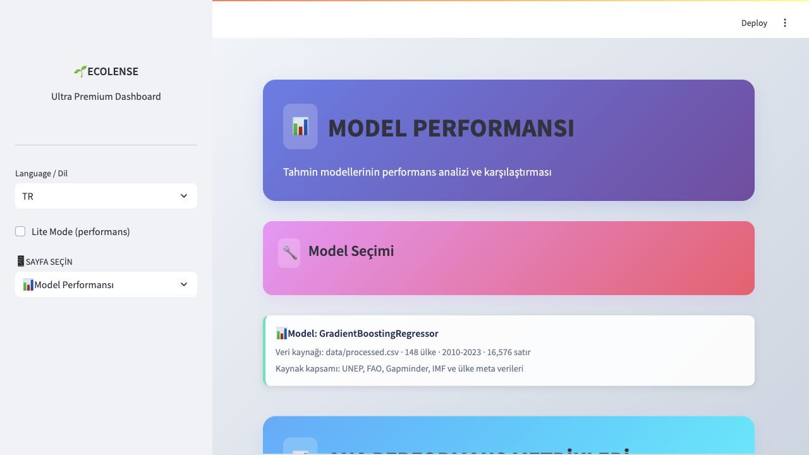
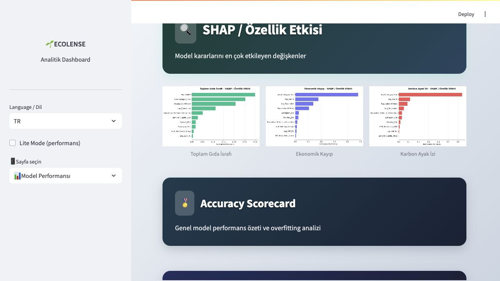

<div align="center">

# Ecolense Intelligence

### Küresel Gıda Atığı Analizi ve Sürdürülebilirlik Karar Destek Platformu

[](https://www.python.org/)
[](https://streamlit.io/)
[](https://scikit-learn.org/)
[](https://ecolense-intelligence.streamlit.app/)

[Canlı Dashboard](https://ecolense-intelligence.streamlit.app/) · [Teknik Rapor](ecolense_intelligence_raporu_2026.md) · [English README](README.en.md)

</div>

---

## Genel Bakış

Ecolense Intelligence, küresel gıda israfını ülke, yıl ve gıda kategorisi düzeyinde inceleyen veri odaklı bir karar destek platformudur. Dashboard; gıda israfı, ekonomik kayıp, karbon ayak izi ve sürdürülebilirlik skorunu aynı analitik çatı altında birleştirir.

| Gösterge | Değer |
|---|---:|
| Ülke sayısı | 148 |
| Tarihsel dönem | 2010-2023 |
| Tahmin ufku | 2024-2030 |
| Toplam gözlem | 16.576 |
| Ortalama test R² | 0,9534 |
| 2023 ortalama sürdürülebilirlik skoru | 82,7/100 |
| 2030 ortalama sürdürülebilirlik projeksiyonu | 82,5/100 |
| Dashboard modülü | 22 |

---

## Dashboard Önizleme







---

## Analitik Görseller

Tahmin grafiği farklı ölçekleri aynı eksene sıkıştırmaz; israf, ekonomik kayıp, karbon ve skor ayrı panellerde gösterilir.


---

## Sürdürülebilirlik Skoru

Sürdürülebilirlik skoru, ülke düzeyinde kişi başı gıda israfı, kişi başı ekonomik kayıp ve kişi başı karbon baskısını birlikte okuyan 0-100 arası bileşik göstergedir. Yüksek skor, bu üç baskının aynı anda daha kontrollü olduğu bir profili gösterir.

2023 verisinde ortalama skor 82,7/100, ülke medyanı 82,9/100 seviyesindedir. En yüksek skorlar India, Russia, Romania, South Africa ve Lithuania tarafında yoğunlaşır. 2024-2030 projeksiyonunda skor 2023 ölçeğinden koparılmadan, aynı ülkenin kişi başı atık, ekonomik kayıp ve karbon baskısındaki değişime göre güncellenir.

Bu gösterge resmi SDG Index puanı değildir. 2025 Sustainable Development Report / SDG Index veritabanı ile yapılan dış kontrolde 146 ülke eşleşmiştir. Ecolense kompozit skoru ile 2025 genel SDG Index skoru arasındaki Pearson korelasyonu 0,04; SDG 12 skoru ile 0,20; SDG 13 skoru ile 0,39 olarak ölçülmüştür. Bu sonuç, Ecolense skorunun genel sürdürülebilirlik performansını değil; gıda israfı, ekonomik kayıp ve karbon baskısı odağındaki karar destek profilini gösterdiğini doğrular.

---

## Veri Seti ve Metodoloji

Veri seti ülke-yıl-kategori kırılımında hazırlanmıştır. Analizde gıda israfı, ekonomik kayıp, karbon ayak izi, nüfus, kişi başı gelir, materyal ayak izi, gıda fiyat endeksi, gelir grubu ve bölge bilgileri birlikte kullanılır.

| Yayın / veri sürümü | Kaynak | Kullanım | Proje kapsamı |
|---|---|---|---|
| 2010-2023 serisi | Gapminder GDP per capita | Ülke bazlı gelir serileri | GDP per capita değişkenleri |
| 2010-2023 serisi | FAO Food Price Index | Gıda fiyat endeksi ve dönemsel fiyat hareketleri | Yıl etkisi ve fiyat endeksi değişkenleri |
| 2018 | Poore & Nemecek, *Science* | Gıda kategorilerine göre karbon etkisi | Kategori bazlı CO2e katsayıları |
| 2021 | UNEP Food Waste Index Report | Ülke bazlı gıda atığı göstergeleri | Tablo A4.1 ve ülke göstergeleri |
| 2024 güncel veri tabanı | UNEP IRP Global Material Flows Database | Materyal ayak izi göstergeleri | Kişi başına materyal ayak izi |
| Ekim 2024 | IMF World Economic Outlook Database | 2024-2030 makro projeksiyon girdileri | Büyüme varsayımları |
| 2025 | Sustainable Development Report / SDG Index Database | 2025 SDG Index ve hedef skorları | Dış doğrulama ve kapsam kontrolü |
| Erişim: 2 Haziran 2026 | Ülke meta verileri | Bölge, gelir grubu, ISO kodu ve nüfus bilgileri | Dashboard etiketleri ve ülke kırılımları |

Veri hattı üç temel adımdan oluşur:

1. Kaynak verilerin ortak ülke-yıl-kategori seviyesinde hazırlanması
2. Model girdileri için oran, yoğunluk, etkileşim ve dönem değişkenlerinin üretilmesi
3. Tahmin, açıklanabilirlik ve rapor çıktılarının dashboard formatına dönüştürülmesi

---

## Modelleme

Modelleme üç hedef için ayrı ayrı yapılır:

| Hedef | Açıklama | Test R² | CV R² |
|---|---|---:|---:|
| `Total Waste (Tons)` | Toplam gıda israfı | 0,9674 | 0,9684 |
| `Economic Loss (Million $)` | Ekonomik kayıp | 0,9464 | 0,9458 |
| `Carbon_Footprint_kgCO2e` | Karbon ayak izi | 0,9464 | 0,9609 |

Gradient Boosting Regressor ana üretim modeli olarak kullanılır. Açıklanabilirlik çıktıları `outputs/explainability/` altında CSV olarak, rapor görselleri `docs/assets/` altında PNG olarak tutulur.


---

## Dashboard Modülleri

| Modül | Ne işe yarar? |
|---|---|
| Ana Sayfa | Projenin ana KPI kartlarını, hızlı geçişleri ve hikaye girişlerini sunar. |
| Veri Analizi | Veri kapsamını, eksik değerleri, dağılımları, korelasyonları ve kategori kırılımlarını inceler. |
| Model Performansı | Test R², CV R², hata metrikleri ve hedef bazlı model kalitesini gösterir. |
| Gelecek Tahminleri | 2024-2030 döneminde ülke ve metrik bazlı tahminleri görselleştirir. |
| Hedef Bazlı Tahminler | Seçilen ülke/metrik için hedef senaryolarını tahmin ufkunda takip eder. |
| What-if | Nüfus, kategori azaltımı ve politika varsayımlarının etkisini senaryo olarak hesaplar. |
| Country Deep Dive | Tek ülkenin tarihsel profilini, kategori etkisini ve tahmin seyrini detaylandırır. |
| Driver Sensitivity | Sürücü değişkenlerin hedef metrik üzerindeki duyarlılığını karşılaştırır. |
| ROI / NPV | Azaltım senaryolarının finansal geri dönüşünü ve net bugünkü değerini hesaplar. |
| Benchmark & Lig | Ülkeleri performans liginde sıralar ve karşılaştırmalı konumlarını gösterir. |
| Anomali & İzleme | Aykırı değerleri ve izleme sinyallerini kontrol eder. |
| Veri Hattı & Kalite | Dosya kaynaklarını, veri kapsamını, satır/sütun kalitesini, SDG Index dış doğrulama çıktısını ve üretim akışını özetler. |
| Karbon Akışları | Karbon yükünün kategori, ülke veya kıta üzerinden nasıl dağıldığını gösterir. |
| Model Karşılaştırma | Model sonuçlarını, hedef bazlı performansı ve özellik etkilerini birlikte değerlendirir. |
| Politika Simülatörü | Atık azaltımı, karbon fiyatı ve teknoloji benimsemesi gibi politika girdilerini test eder. |
| İçgörü Paneli | CAGR analizi, SHAP etkileri ve seçilen ülke/metrik bağlamında içgörü üretir. |
| Risk & Fırsat | Ülkeleri risk ve fırsat eksenlerinde konumlandırır. |
| Hedef Planlayıcı | 2030 hedefine ulaşmak için gerekli yıllık değişim oranını hesaplar. |
| Rapor Oluşturucu | Seçilen rapor türüne göre farklı, veri kaynaklı HTML/Markdown rapor üretir. |
| Model Kartı | Model yaklaşımı, performans, sınırlılıklar ve etik notları tek sayfada toplar. |
| Adalet / Etki Paneli | Etkinin ülke, bölge ve gelir grubu kırılımında adil dağılımını inceler. |
| Story Mode | Başlığına uygun veri kesitlerinden bulgu, yorum ve önerilen aksiyon içeren veri hikayeleri sunar. |

---

## Yapay Zeka Asistanı

Dashboard genelinde sağ alt köşede açılan Yapay Zeka Asistanı, sayfa içeriğini kalabalıklaştırmadan çalışır. Soru metninden ülke, metrik, kategori, yıl ve niyet bilgisini yakalar; birden fazla soru varsa bunları ayrı veri okuma adımlarına böler. Yanıtlar tarihsel veri, 2024-2030 tahmin çıktısı ve açıklanabilirlik dosyalarından ilgili kesit okunarak üretilir.

Asistan sohbet geçmişini rapor ekranı gibi üst üste yığmaz. Her yeni soru tek aktif yanıt panelini günceller; bu nedenle kullanıcı ekranda her zaman son sorunun veri dayanağıyla birlikte üretilmiş cevabını görür.

---

## Kurulum

```bash
git clone https://github.com/ozgunes91/ecolense-intelligence.git
cd ecolense-intelligence

python -m venv .venv
source .venv/bin/activate
pip install -r requirements.txt
```

Tüm veri hattını çalıştırmak için:

```bash
python run_pipeline.py
```

Dashboardu başlatmak için:

```bash
streamlit run app.py
```

---

## Klasör Yapısı

```text
ecolense-intelligence/
├── data/
│   ├── global_food_waste_real_world.csv
│   ├── processed.csv
│   └── meta.json
├── docs/assets/
│   ├── dashboard_home.jpg
│   ├── dashboard_home_tr.png
│   ├── dashboard_home_en.png
│   ├── dashboard_model_performance.jpg
│   ├── dashboard_shap_section.jpg
│   ├── forecast_trends.png
│   ├── forecast_trends_en.png
│   ├── category_waste_2023.png
│   ├── category_waste_2023_en.png
│   ├── model_performance_summary.png
│   ├── model_performance_summary_en.png
│   ├── shap_feature_impact_overview.png
│   ├── shap_feature_impact_overview_en.png
│   ├── shap_total_waste.png
│   ├── shap_economic_loss.png
│   ├── shap_carbon_footprint.png
│   ├── shap_total_waste_en.png
│   ├── shap_economic_loss_en.png
│   ├── shap_carbon_footprint_en.png
│   ├── sdg_index_alignment.png
│   └── sdg_index_alignment_tr.png
├── outputs/
│   ├── forecasts/forecasts.csv
│   ├── metrics/model_performance.json
│   ├── explainability/shap_*.csv
│   └── validation/sdg_index_comparison.*
├── models/
├── 01_prepare_data.py
├── 02_train_models.py
├── 03_generate_forecasts.py
├── 04_validate_sdg_alignment.py
├── run_pipeline.py
└── app.py
```

---

## Kaynakça

Kaynaklar yayın/veri sürümü tarihine göre kronolojik sıralanmıştır. Web kaynakları için erişim tarihi: 2 Haziran 2026.

- 2010-2023 veri serisi — Gapminder Foundation. [*GDP per capita / income per person data*](https://www.gapminder.org/data/). Ülke bazlı gelir değişkenleri için kullanıldı.
- 2010-2023 veri serisi — FAO. [*Food Price Index*](https://www.fao.org/worldfoodsituation/foodpricesindex/en/). Gıda fiyat endeksi ve dönemsel fiyat hareketleri için kullanıldı.
- 2017 — Lundberg, S. M. & Lee, S.-I. [*A Unified Approach to Interpreting Model Predictions*](https://proceedings.neurips.cc/paper/2017/hash/8a20a8621978632d76c43dfd28b67767-Abstract.html). NeurIPS 2017. SHAP tabanlı model açıklanabilirliği için kullanıldı.
- 2018 — Poore, J. & Nemecek, T. [*Reducing food's environmental impacts through producers and consumers*](https://doi.org/10.1126/science.aaq0216). *Science*, 360(6392), 987-992. Gıda kategorisi karbon etkisi katsayıları için kullanıldı.
- 2021 — UNEP. [*Food Waste Index Report 2021*](https://www.unep.org/resources/report/unep-food-waste-index-report-2021). Ülke bazlı gıda atığı göstergeleri ve Tablo A4.1 için kullanıldı.
- 2024 güncel veri tabanı — UNEP International Resource Panel. [*Global Material Flows Database*](https://www.resourcepanel.org/global-material-flows-database). Kişi başına materyal ayak izi için kullanıldı.
- Ekim 2024 — IMF. [*World Economic Outlook Database, October 2024*](https://www.imf.org/en/Publications/WEO/weo-database/2024/October). 2024-2030 makro büyüme varsayımları için kullanıldı.
- 2025 — Sustainable Development Solutions Network. [*Sustainable Development Report 2025 / SDG Index Database*](https://dashboards.sdgindex.org/explorer/). 2025 SDG Index genel skoru, SDG 2, SDG 12 ve SDG 13 skorlarıyla dış doğrulama için kullanıldı.

---

Ecolense Intelligence, sürdürülebilir gıda sistemleri için veri odaklı karar desteği sunar.
