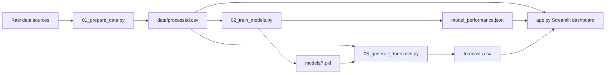

# Ecolense Intelligence

Kuresel gida israfini ulke, kategori, ekonomik kayip ve karbon etkisi ekseninde inceleyen Streamlit dashboard projesi.

[](https://ecolense-intelligence.streamlit.app)
[](https://python.org)
[](#modelleme)

## Canli Dashboard

Dashboard yayini: [ecolense-intelligence.streamlit.app](https://ecolense-intelligence.streamlit.app)

## Proje Ozeti

| Baslik | Deger |
|---|---:|
| Ulke sayisi | 148 |
| Tarihsel donem | 2010-2023 |
| Tahmin ufku | 2024-2030 |
| Gozlem sayisi | 16.576 |
| Model tipi | GradientBoostingRegressor |
| Ortalama test R2 | 0,9534 |


## Veri Kapsami

Proje; gida israfi, ekonomik kayip, karbon ayak izi, nufus, kisi basi gelir, gida fiyat endeksi, malzeme ayak izi ve ulke meta verilerini birlikte kullanir.

| Kaynak | Kullanim |
|---|---|
| UNEP Food Waste Index Report 2021 | Ulke bazli gida israfi baz degerleri |
| FAO Food Price Index | Gida fiyat endeksi ve ileri donem varsayimi |
| Gapminder | Kisi basi gelir serileri |
| IMF WEO | 2024-2030 buyume varsayimlari |
| Poore & Nemecek LCA katsayilari | Kategori bazli karbon etkisi |
| countryinfo / ulke meta verileri | ISO3, bolge, nufus ve gelir grubu |


## Mimari



## Modelleme

Uc hedef ayri ayri modellenir:

- Total Waste (Tons)
- Economic Loss (Million $)
- Carbon_Footprint_kgCO2e

Modelleme notlari:

- Train/test ayrimi: 80/20
- Cross-validation: 3 fold
- Model: Gradient Boosting
- Tahmin katmani: model ciktisi + tarihsel ulke-kategori egilimi + makro varsayimlar
- Skorlama: 0'a yapismayan, taban puanli robust surdurulebilirlik skoru

## Calistirma

```bash
python run_pipeline.py
streamlit run app.py
```

## Dosya Yapisi

```text
.
├── app.py
├── run_pipeline.py
├── 01_prepare_data.py
├── 02_train_models.py
├── 02_train_models_full.py
├── 03_generate_forecasts.py
├── data/
│   ├── global_food_waste_real_world.csv
│   ├── processed.csv
│   └── meta.json
├── docs/
│   └── assets/
│       ├── forecast_trends.png
│       └── category_waste_2023.png
├── forecasts.csv
├── model_performance.json
└── ecolense_intelligence_raporu_2026.md
```

## Dashboard Modulleri

| Modul | Icerik |
|---|---|
| Ana Sayfa | KPI kartlari, hizli erisim ve veri asistani |
| Veri Analizi | Veri seti ozeti, kategori analizi, degisken sozlugu |
| Model Performansi | R2, RMSE, CV ve hedef bazli performans |
| Gelecek Tahminleri | 2024-2030 ulke ve metrik projeksiyonlari |
| Hedef Bazli Tahminler | Ulke/metrik hedef rotasi |
| What-if | Senaryo duyarliligi |
| Risk & Firsat | Ulke risk matrisi |
| Rapor | Indirilebilir calisma raporu |

## Ekip

| Isim | Rol |
|---|---|
| Ozge Gunes | Veri Bilimi ve Dashboard Gelistirme |
| Kubra Saruhan | Veri Analizi ve Modelleme |

Miuul Data Scientist Bootcamp final projesi.
