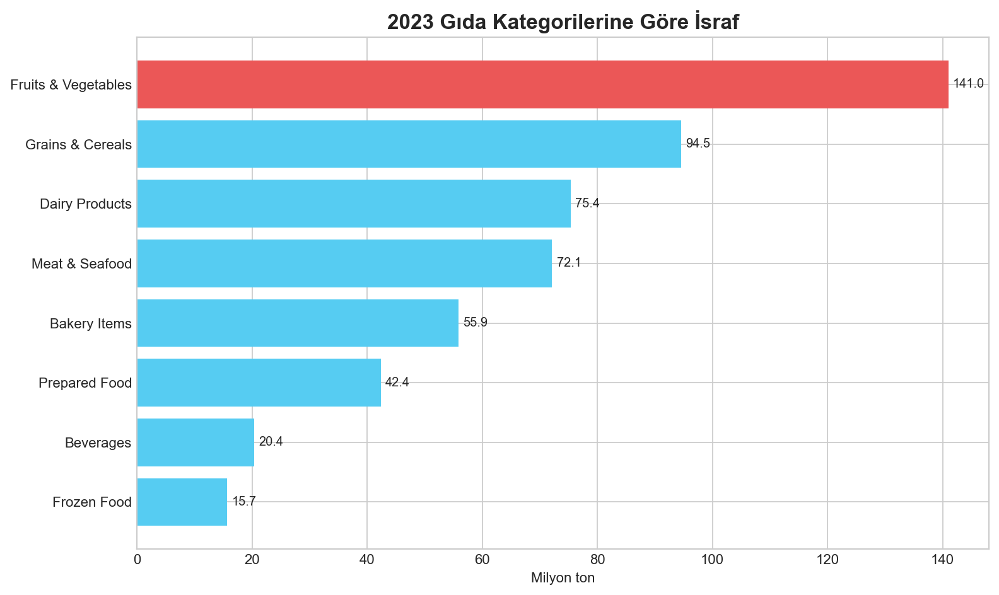
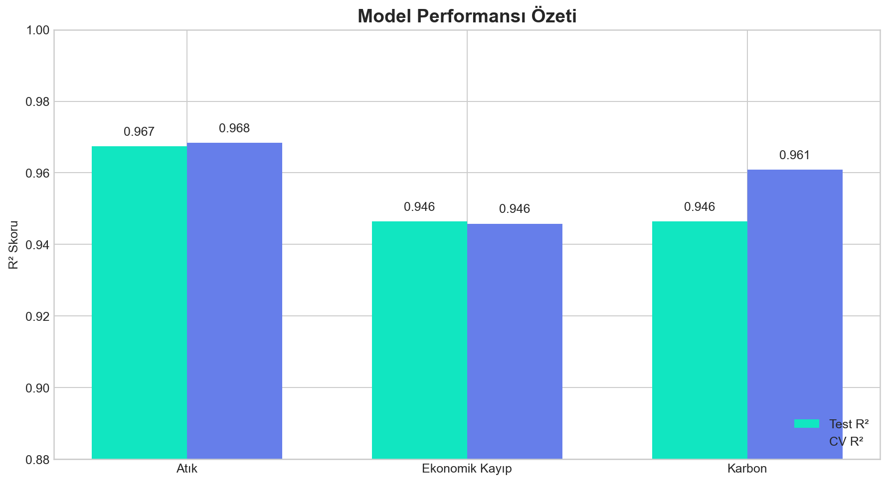
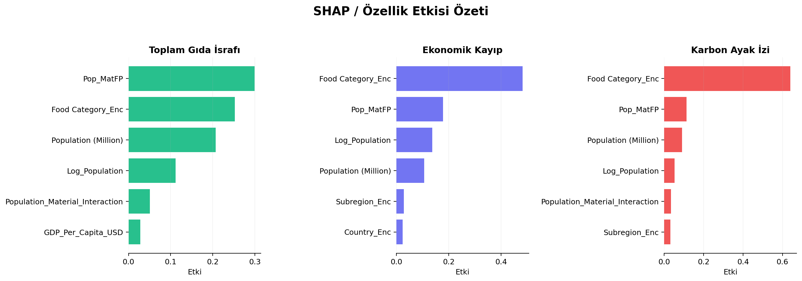
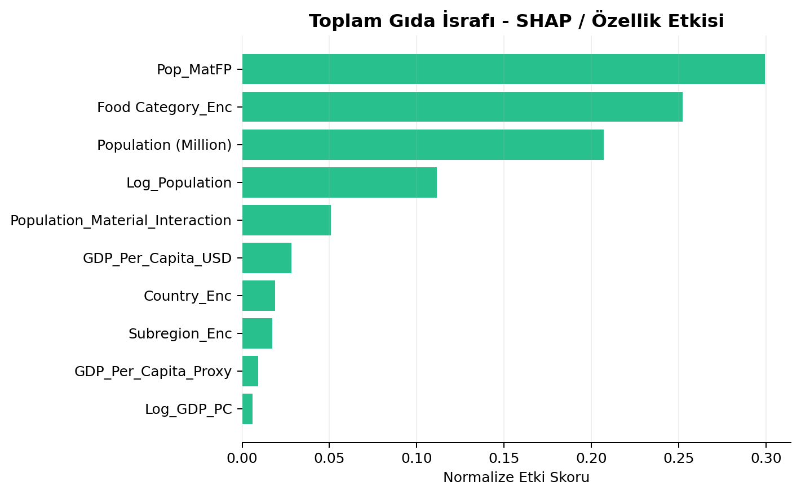
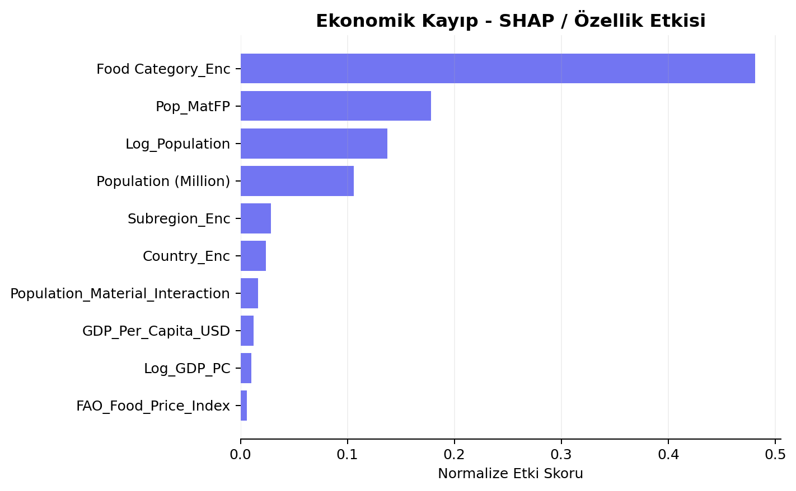
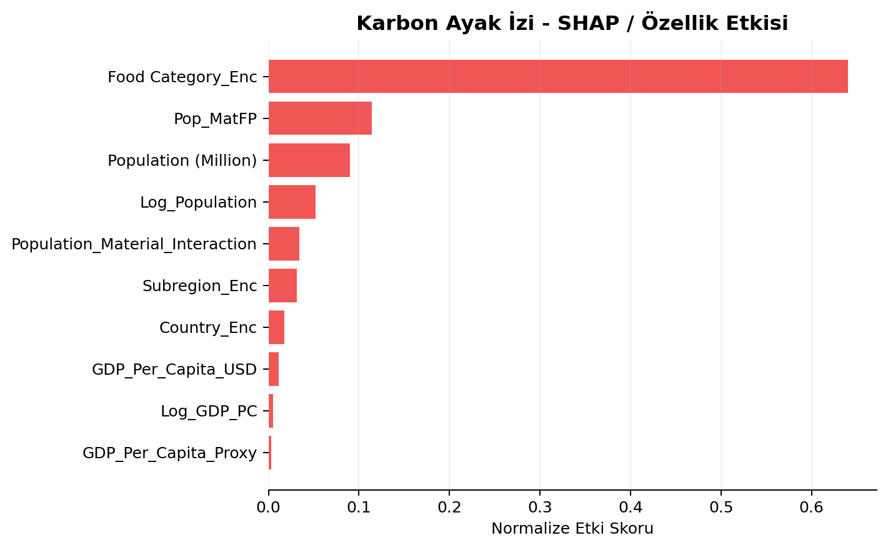
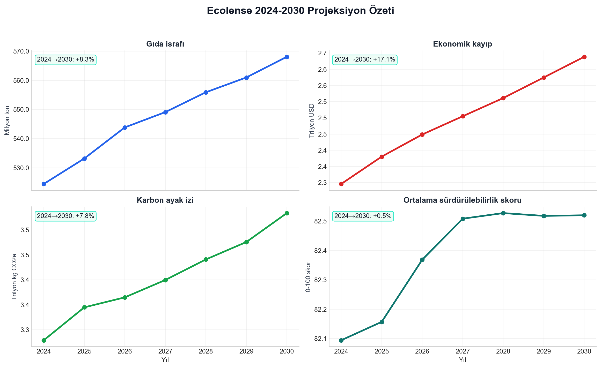
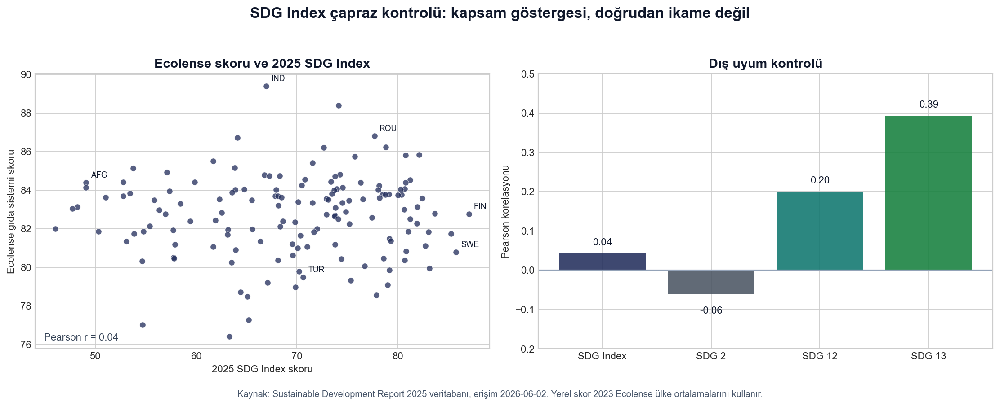
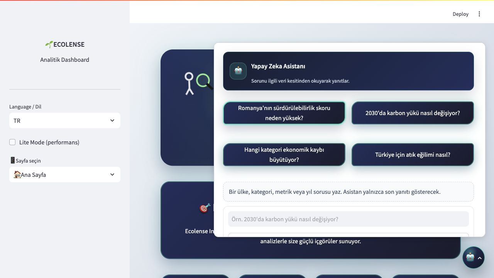

# Ecolense Intelligence Teknik Raporu

**Tarih:** 2 Haziran 2026 
**Canlı Dashboard:** [ecolense-intelligence.streamlit.app](https://ecolense-intelligence.streamlit.app) 
**İngilizce Rapor:** [ecolense_intelligence_report_2026_en.md](ecolense_intelligence_report_2026_en.md) 
**Hazırlayanlar:** Özge Güneş · Kübra Saruhan 
**Kurum:** Miuul Data Scientist Bootcamp

---

## Yönetici Özeti

Ecolense Intelligence, küresel gıda israfını çevresel ve ekonomik etkileriyle birlikte analiz eden bir sürdürülebilirlik karar destek platformudur. Proje; ülke, yıl ve gıda kategorisi kırılımlarını birleştirerek 2010-2023 tarihsel dönemini analiz eder ve 2024-2030 için projeksiyon üretir.

Dashboard, gıda israfını yalnızca toplam ton değeriyle değil; ekonomik kayıp, karbon ayak izi, sürdürülebilirlik skoru, ülke profili ve kategori kompozisyonu üzerinden birlikte yorumlar.

| Gösterge | Değer |
|---|---:|
| Ülke sayısı | 148 |
| Tarihsel dönem | 2010-2023 |
| Tahmin ufku | 2024-2030 |
| Toplam gözlem | 16.576 |
| Ortalama test R² | 0,9534 |
| 2023 ortalama sürdürülebilirlik skoru | 82,7/100 |
| 2030 ortalama sürdürülebilirlik projeksiyonu | 82,5/100 |
| Dashboard modülü | 22 |

---

## Veri Seti

Veri seti ülke-yıl-gıda kategorisi seviyesinde hazırlanmıştır. Çalışmada gıda israfı, ekonomik kayıp, karbon ayak izi, nüfus, kişi başı gelir, materyal ayak izi, gıda fiyat endeksi, gelir grubu ve bölge bilgileri birlikte kullanılmıştır.

| Yayın / veri sürümü | Kaynak | İçerik | Projedeki kullanım |
|---|---|---|---|
| 2010-2023 serisi | Gapminder GDP per capita | Gelir serileri | GDP per capita değişkenleri |
| 2010-2023 serisi | FAO Food Price Index | Gıda fiyat endeksi | Yıl etkisi ve fiyat hareketleri |
| 2018 | Poore & Nemecek, *Science* | Gıda kategorisi yaşam döngüsü etkileri | CO2e katsayıları |
| 2021 | UNEP Food Waste Index Report | Ülke bazlı gıda atığı göstergeleri | Tablo A4.1 ve ülke göstergeleri |
| 2024 güncel veri tabanı | UNEP IRP Global Material Flows Database | Materyal ayak izi | Kişi başına materyal ayak izi |
| Ekim 2024 | IMF World Economic Outlook Database | Makro büyüme varsayımları | 2024-2030 projeksiyon girdileri |
| 2025 | Sustainable Development Report / SDG Index Database | 2025 SDG Index ve hedef skorları | Dış doğrulama ve kapsam kontrolü |
| Erişim: 2 Haziran 2026 | Ülke meta verileri | Bölge, gelir grubu, ISO kodu ve nüfus bilgileri | Dashboard kırılımları |

---

## Modelleme Yaklaşımı

Gradient Boosting Regressor, test performansı ve yorumlanabilirlik dengesi nedeniyle ana üretim modeli olarak seçilmiştir. Üç hedef ayrı ayrı modellenmiştir:

| Hedef | Test R² | CV R² | Aşırı öğrenme |
|---|---:|---:|---:|
| Toplam gıda israfı | 0,9674 | 0,9684 | 0,0195 |
| Ekonomik kayıp | 0,9464 | 0,9458 | 0,0302 |
| Karbon ayak izi | 0,9464 | 0,9609 | 0,0398 |
| Ortalama | 0,9534 | 0,9584 | 0,0300 |

---

## Açıklanabilirlik Analizi

Model açıklanabilirliği hedef bazlı özellik etkisi çıktılarıyla izlenmiştir. Bu çıktılar, karar süreçlerinde hangi değişkenlerin daha belirleyici olduğunu gösterir.

Analiz, kategori ve nüfus temelli değişkenlerin model kararlarında güçlü rol oynadığını gösterir. Bu nedenle politika yorumları yalnızca ülke toplamına değil, kategori kompozisyonuna da dayanır.

---

## 2024-2030 Projeksiyonu

Tahmin grafiği dört farklı metriği ayrı panellerde gösterir. Bu tercih, ekonomik kayıp ve karbon çizgilerinin farklı ölçek nedeniyle sıfıra yakınmış gibi görünmesini engeller.

| Yıl | Gıda israfı | Ekonomik kayıp | Karbon ayak izi | Ortalama skor |
|---:|---:|---:|---:|---:|
| 2024 | 524,4 milyon ton | 2,30 trilyon USD | 3,28 trilyon kg CO2e | 82,1 |
| 2025 | 533,2 milyon ton | 2,38 trilyon USD | 3,34 trilyon kg CO2e | 82,2 |
| 2026 | 543,8 milyon ton | 2,45 trilyon USD | 3,36 trilyon kg CO2e | 82,4 |
| 2027 | 549,1 milyon ton | 2,51 trilyon USD | 3,40 trilyon kg CO2e | 82,5 |
| 2028 | 555,9 milyon ton | 2,56 trilyon USD | 3,44 trilyon kg CO2e | 82,5 |
| 2029 | 561,0 milyon ton | 2,62 trilyon USD | 3,48 trilyon kg CO2e | 82,5 |
| 2030 | 568,1 milyon ton | 2,69 trilyon USD | 3,53 trilyon kg CO2e | 82,5 |

---

## Sürdürülebilirlik Skoru

Sürdürülebilirlik skoru, kişi başı gıda israfı, kişi başı ekonomik kayıp ve kişi başı karbon baskısını birlikte okuyan 0-100 arası bileşik göstergedir. Skor yükseldikçe ülkenin bu üç baskıyı aynı anda daha dengeli yönettiği anlaşılır.

2023 verisinde ortalama skor 82,7/100, ülke medyanı 82,9/100 seviyesindedir. En yüksek skorlar India, Russia, Romania, South Africa ve Lithuania ülkelerinde görülür. En düşük skorlar Kuwait, Nigeria, Saudi Arabia, Qatar ve Australia tarafında yoğunlaşır. 2024-2030 projeksiyonu, her ülkenin 2023 skorunu baz alır ve gelecekteki kişi başı atık, ekonomik kayıp ve karbon baskısı değişimine göre skoru günceller.

## SDG Index ile Dış Kontrol

Ecolense sürdürülebilirlik skoru resmi SDG Index puanı değildir. Skor, gıda israfı, ekonomik kayıp ve karbon baskısını birlikte okumak için tasarlanmış proje içi kompozit göstergedir.

2025 Sustainable Development Report / SDG Index veritabanı ile ülke düzeyinde yapılan dış kontrolde 146 ülke eşleşmiştir. Ecolense kompozit skoru ile 2025 genel SDG Index skoru arasındaki Pearson korelasyonu 0,04; SDG 12 skoru ile 0,20; SDG 13 skoru ile 0,39 olarak hesaplanmıştır. Bu sonuç, dashboardun tam bir SDG performans panosu değil, sürdürülebilir gıda sistemleri için odaklanmış karar destek panosu olduğunu gösterir.

Story Mode bölümündeki SDG 2, SDG 12 ve SDG 13 kartları bu nedenle resmi ikon seti olarak değil, kapsam merceği olarak kullanılır. SDG 2 gıda sistemi baskısını, SDG 12 sorumlu tüketim ve üretim bağlamını, SDG 13 ise karbon etkisini temsil eder.

---

## Dashboard Modülleri

| Modül | İşlev |
|---|---|
| Ana Sayfa | Ana KPI kartları, hızlı geçişler ve hikaye girişleri. |
| Veri Analizi | Veri kapsamı, kalite, dağılım, korelasyon ve kategori analizi. |
| Model Performansı | Test/CV metrikleri, hata ölçümleri ve hedef bazlı model kalitesi. |
| Gelecek Tahminleri | 2024-2030 ülke ve metrik tahminleri. |
| Hedef Bazlı Tahminler | Özel ülke/metrik hedeflerinin tahmin ufkunda takibi. |
| What-if | Varsayım değişikliklerinin çıktılar üzerindeki etkisi. |
| Country Deep Dive | Tek ülke için detaylı tarihsel ve tahminsel analiz. |
| Driver Sensitivity | Sürücü değişkenlerin metriklere etkisinin karşılaştırılması. |
| ROI / NPV | Azaltım senaryolarının finansal geri dönüş hesabı. |
| Benchmark & Lig | Ülkelerin karşılaştırmalı performans sıralaması. |
| Anomali & İzleme | Aykırı değer ve izleme sinyallerinin kontrolü. |
| Veri Hattı & Kalite | Kaynak, dosya, satır/sütun ve üretim akışı kontrolleri. |
| Karbon Akışları | Karbon yükünün kategori, ülke veya kıta dağılımı. |
| Model Karşılaştırma | Model sonuçları, hedef performansı ve özellik etkisi. |
| Politika Simülatörü | Atık azaltımı, karbon fiyatı ve teknoloji benimseme senaryoları. |
| İçgörü Paneli | CAGR analizi, SHAP etkileri ve bağlamsal içgörüler. |
| Risk & Fırsat | Ülkelerin risk ve fırsat eksenlerinde konumlandırılması. |
| Hedef Planlayıcı | 2030 hedefi için gerekli yıllık değişim oranı. |
| Rapor Oluşturucu | Rapor türüne göre farklı HTML/Markdown çıktılar. |
| Model Kartı | Metodoloji, performans, sınırlılıklar ve etik özet. |
| Adalet / Etki Paneli | Etkinin ülke, bölge ve gelir grubu kırılımında incelenmesi. |
| Story Mode | Başlığa uygun veri kesitlerinden bulgu, yorum ve önerilen aksiyon içeren hikayeler. |

---

## Yapay Zeka Asistanı

Yapay Zeka Asistanı, dashboard genelinde sağ alt köşeden açılan sabit bir karar destek bileşenidir. Soru metninden ülke, kategori, metrik, yıl ve niyet bilgisini ayıklar; birden fazla soru varsa bunları ayrı veri okuma adımlarına böler. Ardından tarihsel veri, 2024-2030 tahmin dosyası ve açıklanabilirlik çıktılarından ilgili kesiti okuyarak yanıt üretir.

Asistan arayüzü tek aktif yanıt mantığıyla tasarlanmıştır. Her yeni soru önceki yanıt alanını günceller; ekranda yalnızca son soruya ait veri dayanaklı cevap görünür. Bu yaklaşım, dashboard içinde rapor veya analiz alanlarının gereksiz sohbet geçmişiyle bölünmesini engeller.

---

## Sonuç

Ecolense Intelligence; gıda israfı, ekonomik kayıp ve karbon etkisini birlikte değerlendirerek sürdürülebilirlik ekipleri, araştırmacılar ve politika tasarımcıları için uygulanabilir bir karar destek katmanı sunar. Proje, model performansını açıklanabilirlik ve senaryo modülleriyle birlikte kullandığı için yalnızca tahmin üretmez; hangi alanlara odaklanılması gerektiğini de görünür hale getirir.

---

## Kaynakça

Kaynaklar yayın/veri sürümü tarihine göre kronolojik sıralanmıştır. Web kaynakları için erişim tarihi: 2 Haziran 2026.

- 2010-2023 veri serisi — Gapminder Foundation. [*GDP per capita / income per person data*](https://www.gapminder.org/data/). Ülke bazlı gelir değişkenleri için kullanıldı.
- 2010-2023 veri serisi — FAO. [*Food Price Index*](https://www.fao.org/worldfoodsituation/foodpricesindex/en/). Gıda fiyat endeksi ve dönemsel fiyat hareketleri için kullanıldı.
- 2017 — Lundberg, S. M. & Lee, S.-I. [*A Unified Approach to Interpreting Model Predictions*](https://proceedings.neurips.cc/paper/2017/hash/8a20a8621978632d76c43dfd28b67767-Abstract.html). NeurIPS 2017. SHAP tabanlı model açıklanabilirliği için kullanıldı.
- 2018 — Poore, J. & Nemecek, T. [*Reducing food's environmental impacts through producers and consumers*](https://doi.org/10.1126/science.aaq0216). *Science*, 360(6392), 987-992. Gıda kategorisi karbon etkisi katsayıları için kullanıldı.
- 2021 — UNEP. [*Food Waste Index Report 2021*](https://www.unep.org/resources/report/unep-food-waste-index-report-2021). Ülke bazlı gıda atığı göstergeleri ve Tablo A4.1 için kullanıldı.
- 2024 güncel veri tabanı — UNEP International Resource Panel. [*Global Material Flows Database*](https://www.resourcepanel.org/global-material-flows-database). Kişi başına materyal ayak izi için kullanıldı.
- Ekim 2024 — IMF. [*World Economic Outlook Database, October 2024*](https://www.imf.org/en/Publications/WEO/weo-database/2024/October). 2024-2030 makro büyüme varsayımları için kullanıldı.
- 2025 — Sustainable Development Solutions Network. [*Sustainable Development Report 2025 / SDG Index Database*](https://dashboards.sdgindex.org/explorer/). 2025 SDG Index genel skoru, SDG 2, SDG 12 ve SDG 13 skorlarıyla dış doğrulama için kullanıldı.

---

*Ecolense Intelligence, sürdürülebilir gıda sistemleri için veri odaklı karar desteği sunar.*
