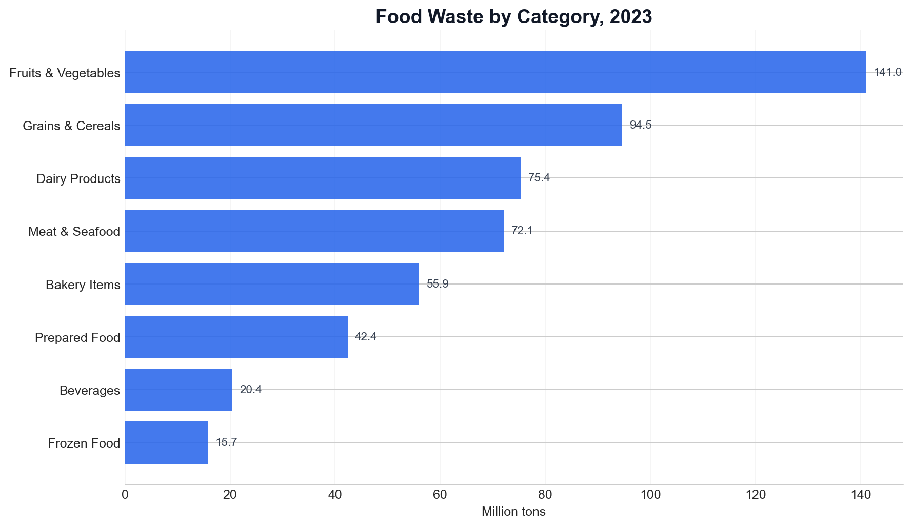
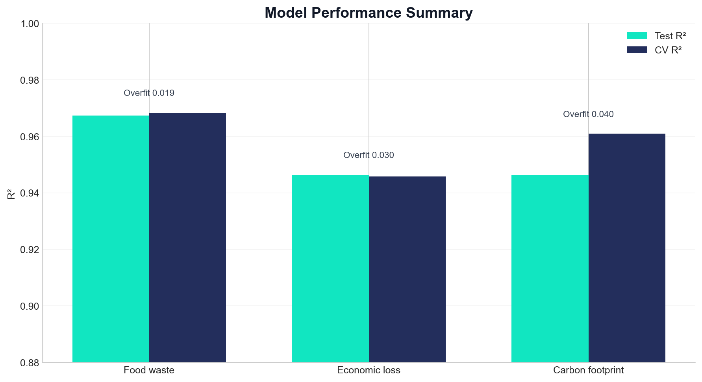
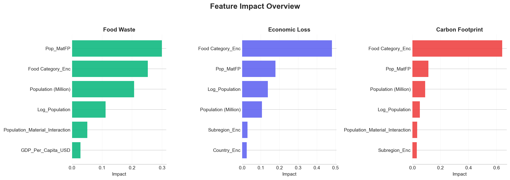
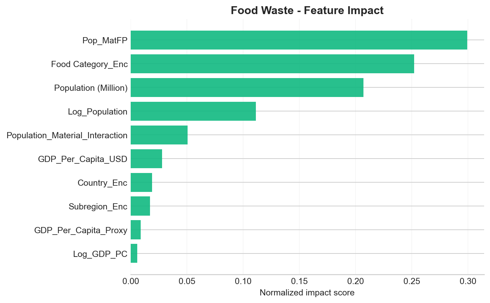
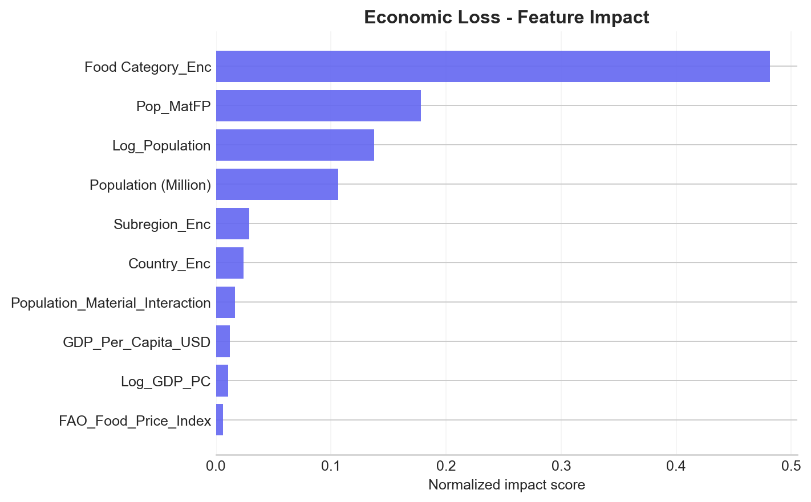
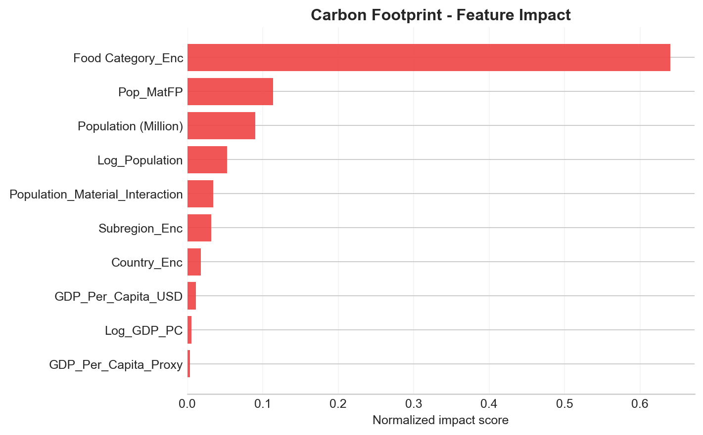
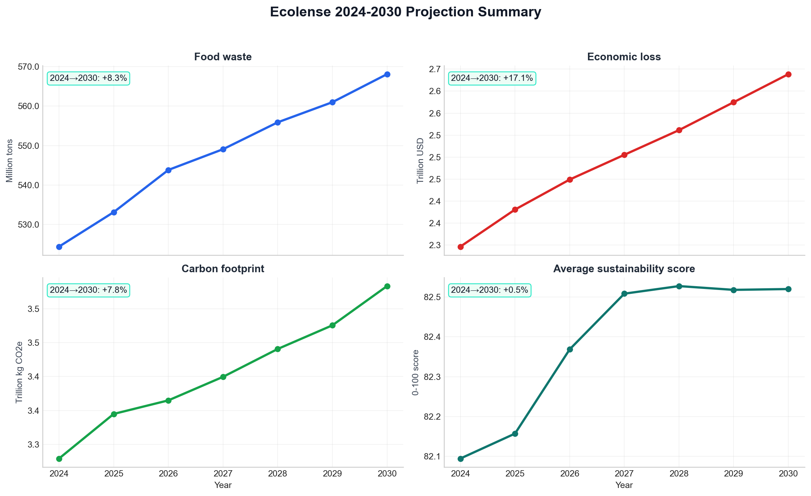
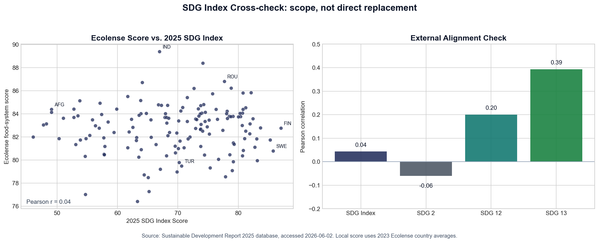
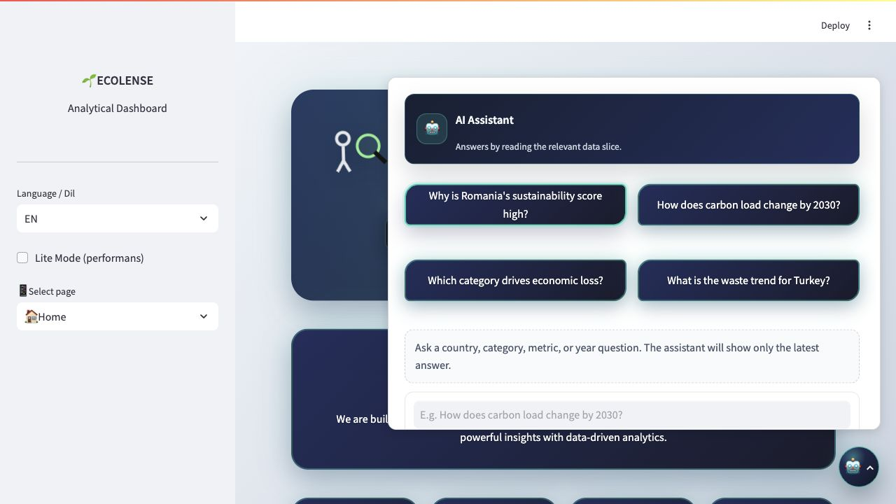

# Ecolense Intelligence Technical Report

**Date:** June 2, 2026 
**Live Dashboard:** [ecolense-intelligence.streamlit.app](https://ecolense-intelligence.streamlit.app) 
**Turkish Report:** [ecolense_intelligence_raporu_2026.md](ecolense_intelligence_raporu_2026.md) 
**Authors:** Özge Güneş · Kübra Saruhan 
**Program:** Miuul Data Scientist Bootcamp

---

## Executive Summary

Ecolense Intelligence is a sustainability decision support platform that analyzes global food waste together with environmental and economic impact. The project combines country, year, and food category slices for the 2010-2023 historical period and produces 2024-2030 projections.

| Metric | Value |
|---|---:|
| Countries | 148 |
| Historical period | 2010-2023 |
| Forecast horizon | 2024-2030 |
| Observations | 16,576 |
| Average test R² | 0.9534 |
| 2023 average sustainability score | 82.7/100 |
| 2030 average sustainability projection | 82.5/100 |
| Dashboard modules | 22 |

---

## Dataset

The dataset is prepared at country-year-food category level. It includes food waste, economic loss, carbon footprint, population, GDP per capita, material footprint, food price index, income group, and regional metadata.

| Publication / data version | Source | Content | Project usage |
|---|---|---|---|
| 2010-2023 series | Gapminder GDP per capita | Income series | GDP per capita variables |
| 2010-2023 series | FAO Food Price Index | Food price index | Year effect and price movement variables |
| 2018 | Poore & Nemecek, *Science* | Food-category life-cycle impacts | CO2e factors |
| 2021 | UNEP Food Waste Index Report | Country-level food waste indicators | Table A4.1 and country indicators |
| 2024 database update | UNEP IRP Global Material Flows Database | Material footprint | Material footprint per capita |
| October 2024 | IMF World Economic Outlook Database | Macro growth assumptions | 2024-2030 projection inputs |
| 2025 | Sustainable Development Report / SDG Index Database | 2025 SDG Index and goal scores | External validation and scope control |
| Accessed June 2, 2026 | Country metadata | Region, income group, ISO code, and population | Dashboard slices |

---

## Modeling Approach

Gradient Boosting Regressor is used as the production model because it provides a strong balance between test performance and interpretability.

| Target | Test R² | CV R² | Overfit |
|---|---:|---:|---:|
| Total food waste | 0.9674 | 0.9684 | 0.0195 |
| Economic loss | 0.9464 | 0.9458 | 0.0302 |
| Carbon footprint | 0.9464 | 0.9609 | 0.0398 |
| Average | 0.9534 | 0.9584 | 0.0300 |

---

## Explainability

Model explainability is tracked through target-level feature impact outputs. These outputs show which variables are most influential in model decisions.

The results show that category and population-related variables play a strong role across targets. Policy interpretation should therefore consider both country scale and category composition.

---

## 2024-2030 Projection

The forecast visual uses separate panels for the four metrics. This prevents economic loss and carbon lines from appearing incorrectly close to zero because of mixed units.

| Year | Food waste | Economic loss | Carbon footprint | Average score |
|---:|---:|---:|---:|---:|
| 2024 | 524.4 million tons | 2.30 trillion USD | 3.28 trillion kg CO2e | 82.1 |
| 2025 | 533.2 million tons | 2.38 trillion USD | 3.34 trillion kg CO2e | 82.2 |
| 2026 | 543.8 million tons | 2.45 trillion USD | 3.36 trillion kg CO2e | 82.4 |
| 2027 | 549.1 million tons | 2.51 trillion USD | 3.40 trillion kg CO2e | 82.5 |
| 2028 | 555.9 million tons | 2.56 trillion USD | 3.44 trillion kg CO2e | 82.5 |
| 2029 | 561.0 million tons | 2.62 trillion USD | 3.48 trillion kg CO2e | 82.5 |
| 2030 | 568.1 million tons | 2.69 trillion USD | 3.53 trillion kg CO2e | 82.5 |

---

## Sustainability Score

The sustainability score is a 0-100 composite indicator that reads food waste per capita, economic loss per capita, and carbon pressure per capita together. As the score rises, the country is managing these three pressures more consistently.

In the 2023 data, the average score is 82.7/100 and the country median is 82.9/100. The highest scores are observed in India, Russia, Romania, South Africa, and Lithuania. The lowest scores are concentrated in Kuwait, Nigeria, Saudi Arabia, Qatar, and Australia. The 2024-2030 projection uses each country's 2023 score as the baseline and updates it according to projected changes in per-capita waste, economic loss, and carbon pressure.

## External SDG Index Check

The Ecolense sustainability score is not the official SDG Index score. It is an internal composite indicator designed to read food waste, economic loss, and carbon pressure together.

The external check against the 2025 Sustainable Development Report / SDG Index database matched 146 countries. The Pearson correlation between the Ecolense composite score and the 2025 overall SDG Index score is 0.04; the correlation with SDG 12 is 0.20, and the correlation with SDG 13 is 0.39. This means the dashboard should be read as a focused decision-support layer for sustainable food systems, not as a full SDG performance dashboard.

The SDG 2, SDG 12, and SDG 13 cards in Story Mode are therefore used as a scope lens, not as the official icon set. SDG 2 represents food-system pressure, SDG 12 frames responsible consumption and production, and SDG 13 represents carbon impact.

---

## Dashboard Modules

| Module | Purpose |
|---|---|
| Home | Main KPI cards, quick navigation, and story entry points. |
| Data Analysis | Data coverage, quality, distributions, correlations, and category analysis. |
| Model Performance | Test/CV metrics, errors, and target-level model quality. |
| Forecasts | 2024-2030 country and metric forecasts. |
| Target-based Forecasts | Custom country/metric target tracking across the forecast horizon. |
| What-if | Effects of changed assumptions on outputs. |
| Country Deep Dive | Detailed historical and forecast analysis for one country. |
| Driver Sensitivity | Comparison of driver effects on metrics. |
| ROI / NPV | Financial return calculation for reduction scenarios. |
| Benchmark & League | Comparative country performance ranking. |
| Anomaly & Monitoring | Outlier and monitoring signal checks. |
| Data Lineage & Quality | Source, file, row/column, and production flow checks. |
| Carbon Flows | Category, country, or continent distribution of carbon load. |
| Model Comparison | Model results, target performance, and feature impact. |
| Policy Simulator | Waste reduction, carbon price, and technology adoption scenarios. |
| Insight Panel | CAGR analysis, SHAP effects, and contextual insights. |
| Risk & Opportunity | Country positioning on risk and opportunity axes. |
| Target Planner | Annual change required to reach a 2030 target. |
| Report Builder | Different HTML/Markdown outputs by report type. |
| Model Card | Methodology, performance, limitations, and ethics summary. |
| Justice / Impact Panel | Impact analysis by country, region, and income group. |
| Story Mode | Stories with findings, interpretation, and recommended actions generated from title-specific data slices. |

---

## AI Assistant

The AI Assistant is a dashboard-wide decision support component opened from the lower-right corner. It extracts country, category, metric, year, and intent from the question; when the input contains multiple questions, it separates them into distinct data-reading steps. It then retrieves the relevant historical data, 2024-2030 forecast output, and explainability slices before generating the answer.

The interface follows a single-active-answer pattern. Each new question updates the previous answer area, so only the latest evidence-backed response remains visible. This keeps reports and analysis views from being crowded by accumulated chat history.

---

## Conclusion

Ecolense Intelligence combines food waste, economic loss, and carbon impact into one decision layer. The project does not only produce forecasts; it also shows which countries, categories, and drivers deserve attention through explainability, scenario, and reporting modules.

---

## References

References are listed chronologically by publication or data-version date. Web sources were accessed on June 2, 2026.

- 2010-2023 data series — Gapminder Foundation. [*GDP per capita / income per person data*](https://www.gapminder.org/data/). Used for country income variables.
- 2010-2023 data series — FAO. [*Food Price Index*](https://www.fao.org/worldfoodsituation/foodpricesindex/en/). Used for food price index and time-effect variables.
- 2017 — Lundberg, S. M. & Lee, S.-I. [*A Unified Approach to Interpreting Model Predictions*](https://proceedings.neurips.cc/paper/2017/hash/8a20a8621978632d76c43dfd28b67767-Abstract.html). NeurIPS 2017. Used for SHAP-based model explainability.
- 2018 — Poore, J. & Nemecek, T. [*Reducing food's environmental impacts through producers and consumers*](https://doi.org/10.1126/science.aaq0216). *Science*, 360(6392), 987-992. Used for food-category carbon impact factors.
- 2021 — UNEP. [*Food Waste Index Report 2021*](https://www.unep.org/resources/report/unep-food-waste-index-report-2021). Used for country-level food waste indicators and Table A4.1.
- 2024 database update — UNEP International Resource Panel. [*Global Material Flows Database*](https://www.resourcepanel.org/global-material-flows-database). Used for material footprint per capita.
- October 2024 — IMF. [*World Economic Outlook Database, October 2024*](https://www.imf.org/en/Publications/WEO/weo-database/2024/October). Used for 2024-2030 macro growth assumptions.
- 2025 — Sustainable Development Solutions Network. [*Sustainable Development Report 2025 / SDG Index Database*](https://dashboards.sdgindex.org/explorer/). Used for external validation against the 2025 overall SDG Index score and SDG 2, SDG 12, and SDG 13 scores.

---

*Ecolense Intelligence provides data-driven decision support for sustainable food systems.*
